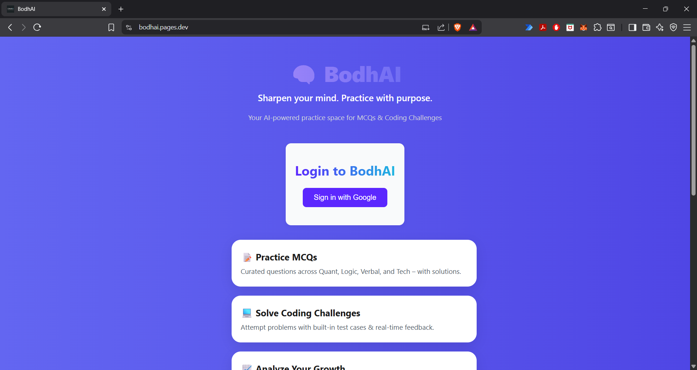
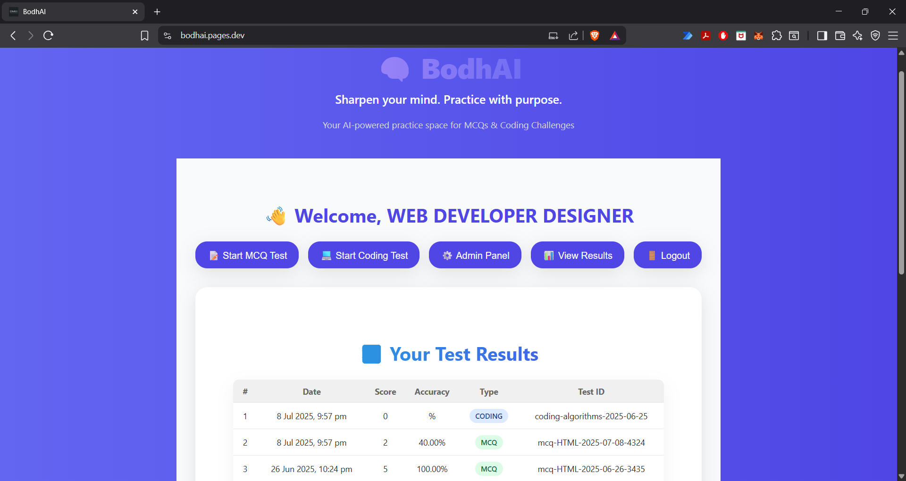

# Bodhai

Live: [https://bodhai.pages.dev/](https://bodhai.pages.dev/)

## Changelog

🔹 **v1.0.0 — MCQ Module Launch**  
✅ `TestMCQ.js` with auto-score, accuracy, timer  
✅ Admin quiz upload, Firestore result storage  
✅ Result view with localStorage caching  

🔹 **v0.0.9 — Login & Register UI Polish**  
✅ Redesigned login & register forms  
✅ Google and Email login flows complete  
✅ `invitedBy` tracking via URL param  

🔹 **v0.0.8 — Routing & Protected Pages**  
✅ Private routes for authenticated users  
✅ Invite page (`/invite?from=`) logic handled  

🔹 **v0.0.7 — Result Views Setup**  
✅ `MCQResult.js` with explanation and answer review  
✅ Results saved in localStorage  

🔹 **v0.0.6 — Admin Panel Enhancements**  
✅ Grouped quizzes by topic  
✅ Added metadata: topic, date, createdBy  
✅ Quiz structure standardized for MCQ  

🔹 **v0.0.5 — Styling & UX Polish**  
✅ Modern font, card layout, branding  
✅ Responsive home UI with New branding with “🧠 BodhAI” + Sanskrit quote  

🔹 **v0.0.4 — Firebase Rules + MCQ Submit Logic**  
✅ Firebase read/write access rules  
✅ MCQ submission & local caching logic  

**v0.0.3 — Basic Test Pages**  
✅ Placeholder pages for MCQ and coding  
✅ Timer & question navigation skeleton  

**v0.0.2 — First Quiz Rendering**  
✅ MCQs pulled live from Firebase  
✅ Timer and local state for answers  
✅ Basic UI for quiz rendering  
✅ Score calculated on submit  

**v0.0.1 — Base Version**  
✅ React + Firebase setup  
✅ Firebase Auth + Plain CSS  
✅ Dashboard routing with default Home  

---

## About Bodhai

**Bodhai** is an AI-powered practice platform for MCQs and coding challenges. It helps you sharpen your skills with live quizzes, instant scoring, and analytics. Designed for students, job-seekers, and anyone preparing for technical interviews or competitive exams.

---

## Features

- 📝 **Practice MCQs**: Curated questions across Quant, Logic, Verbal, and Tech, with explanations.
- 💻 **Coding Challenges**: Attempt coding problems with a built-in editor (mock logic for now).
- 🔥 **Live Quizzes**: MCQs are fetched live from Firebase; new quizzes can be added by admins.
- ⏱️ **Timer & Navigation**: Quiz timer and question navigation skeleton implemented.
- 📊 **Results & Analytics**: View your scores, accuracy, and test history.
- 🧑‍💻 **Google Auth**: Secure login with Google.
- 🛠️ **Admin Panel**: Upload MCQs manually, via JSON, or generate with Gemini AI (admin only).
- 📨 **Invite Friends**: Share invite links and challenge your friends.
- 🌐 **Deployed on Cloudflare Pages**: Fast, global access.

---

## How It Works

1. **Login**: Sign in with Google to access the dashboard.
2. **Dashboard**: Choose to start an MCQ or coding test, view results, or invite friends.
3. **MCQ Test**: Answer questions, submit, and get instant feedback with explanations.
4. **Coding Test**: (Mock) Write and submit code for coding challenges.
5. **Results**: Track your performance and accuracy over time.
6. **Admin**: (If admin) Upload or generate new questions for everyone.

---

## Tech Stack

- **Frontend**: React, CSS
- **Backend**: Firebase (Auth, Realtime Database, Firestore)
- **AI Generation**: API (for admins, via backend)
- **Deployment**: Cloudflare Pages

---

## Contribution

Want to contribute?  
- Fork the repo and submit a PR.
- For feature requests or bug reports, open an issue.

---

## Screenshots

<!-- Add screenshots here if available -->

---

## Getting Started with Create React App

This project was bootstrapped with [Create React App](https://github.com/facebook/create-react-app).

## Available Scripts

In the project directory, you can run:

### `npm start`

Runs the app in the development mode.\
Open [http://localhost:3000](http://localhost:3000) to view it in your browser.

The page will reload when you make changes.\
You may also see any lint errors in the console.

### `npm test`

Launches the test runner in the interactive watch mode.\
See the section about [running tests](https://facebook.github.io/create-react-app/docs/running-tests) for more information.

### `npm run build`

Builds the app for production to the `build` folder.\
It correctly bundles React in production mode and optimizes the build for the best performance.

The build is minified and the filenames include the hashes.\
Your app is ready to be deployed!

See the section about [deployment](https://facebook.github.io/create-react-app/docs/deployment) for more information.

### `npm run eject`

**Note: this is a one-way operation. Once you `eject`, you can't go back!**

If you aren't satisfied with the build tool and configuration choices, you can `eject` at any time. This command will remove the single build dependency from your project.

Instead, it will copy all the configuration files and the transitive dependencies (webpack, Babel, ESLint, etc) right into your project so you have full control over them. All of the commands except `eject` will still work, but they will point to the copied scripts so you can tweak them. At this point you're on your own.

You don't have to ever use `eject`. The curated feature set is suitable for small and middle deployments, and you shouldn't feel obligated to use this feature. However we understand that this tool wouldn't be useful if you couldn't customize it when you are ready for it.

## Learn More

You can learn more in the [Create React App documentation](https://facebook.github.io/create-react-app/docs/getting-started).

To learn React, check out the [React documentation](https://reactjs.org/).

### Code Splitting

This section has moved here: [https://facebook.github.io/create-react-app/docs/code-splitting](https://facebook.github.io/create-react-app/docs/code-splitting)

### Analyzing the Bundle Size

This section has moved here: [https://facebook.github.io/create-react-app/docs/analyzing-the-bundle-size](https://facebook.github.io/create-react-app/docs/analyzing-the-bundle-size)

### Making a Progressive Web App

This section has moved here: [https://facebook.github.io/create-react-app/docs/making-a-progressive-web-app](https://facebook.github.io/create-react-app/docs/making-a-progressive-web-app)

### Advanced Configuration

This section has moved here: [https://facebook.github.io/create-react-app/docs/advanced-configuration](https://facebook.github.io/create-react-app/docs/advanced-configuration)

### Deployment

This section has moved here: [https://facebook.github.io/create-react-app/docs/deployment](https://facebook.github.io/create-react-app/docs/deployment)

### `npm run build` fails to minify

This section has moved here: [https://facebook.github.io/create-react-app/docs/troubleshooting#npm-run-build-fails-to-minify](https://facebook.github.io/create-react-app/docs/troubleshooting#npm-run-build-fails-to-minify)
